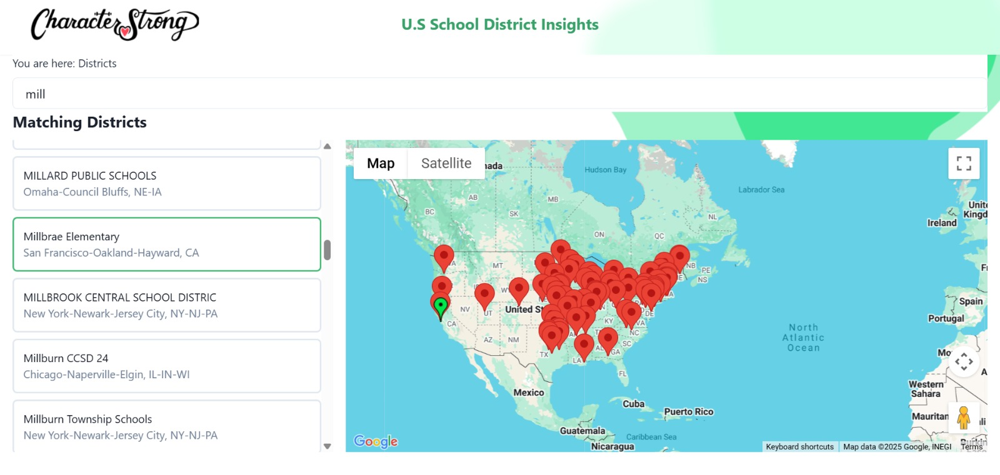

# Features Implemented
# Dynamic Search (Districts & Schools)
District Search: Type at least 3 characters to begin seeing matching districts in the dropdown.

School Search: Once a district is selected, a school search bar appears above the list of schools within that district.

Both search bars update results dynamically as you type (case-insensitive).

Districts and schools are alphabetically sorted and show the city name beside each entry.

# Interactive Map & List View

The school list and map are interconnected for an enhanced user experience:

Hover over a school in the list → highlights the corresponding marker in green on the map.

Hover over a marker → highlights the matching school in the list.

Click on either a list item or a map marker to select a school and view its details.

# School Details
School detail view includes:

Name, city, state

Additional metadata fetched from NCES Public School Characteristics (Current)

(Note: Data currently available for public schools only)

A “View on Google Maps” button lets users open the selected school’s location directly on Google Maps.

------------------------------------------------------------------------------------------------------
# Hello Aspiring Applicant!

This coding exercise is meant to allow you to demonstrate creative problem solving and modern web development understanding. Feel free to stretch the boundaries of the prompt to showcase your personal preferences and skills. 

- Add any npm modules you may need for best practices
- Make any changes to this repository as you see fit
- Use comments to critique and guide code review

## Overview of this repository

- [Vite](https://vitejs.dev/guide/) Typescript React base
- [Chakra-UI](https://chakra-ui.com/docs/principles) interface styling (feel free to replace with your favorite UI)
- [Pretty resolver](tsconfig.paths.json), aliased modules for readability: `import Home from "@components/Home"`
- [Github Actions](.github/workflows/push.yaml) to build and deploy this project to Github Pages (creates `gh-pages` branch)

### Getting Started

1. Extract the repository `unzip react-interview-exercise`
2. Install dependencies `cd react-interview-exercise && npm i`
3. Run local development server `npm run dev`
4. Navigate to http://localhost:3000
5. Follow the Prompt
7. Create a new private Github repository. Please invite @wallstead, @derek-cs, @3103ski, and @chrismochinski
8. Initialize and push to Github `git init` `git origin add your-repo-url` `git push origin main`

## Prompt

The goal of this exercise is to build a prototype utility that gives users ability to search and view school district information from [NCES + ArcGIS apis](https://data-nces.opendata.arcgis.com/datasets/nces::private-school-locations-current/api). See [this dataset and others](https://data-nces.opendata.arcgis.com/datasets/school-district-characteristics-2019-20/explore). The api methods are already [implemented for you in this repository](src/utils/nces.ts), your objective is to create an interactive interface to filter and view the selected data. 

- Push all your changes to Github
    - Looking for semi-descriptive commit messages
- Working out of [Home.tsx](/src/components/Home.tsx):
    - Add the needed React `useEffect` statements for district and school searching
    - Create the UX around these 2 functions, utilize search inputs, lists, and a view container
    - District and School selection functionality, display a list, then when selected show more information

### Considerations

- If there is a requirement for more components, create them for optimal code readability and performance
- If something should be dramatically changed in the setup or organization of this repository, do so or document your perspective
- Most importantly, have fun! Express your passion for web development, we are lifelong learners and should enjoy tackling difficult challenges

## Extra Credit

- Please enable Github Pages and Github Actions in your Fork and update the url in your README.md
    - If your repository is not named `react-interview-exercise` you must update [vite.config.ts](vite.config.ts) "base" path
    - Especially if you are applying for a Fullstack position, we want to see your ability to deploy an app.
    - Unless you have github pro, you may need to make your repository public to enable Github Pages. That's fine, just please remember to make it private again after the interview process.
- CharacterStrong is design-forward, with a strong focus on creating a user experience that supports teachers and students alike. We use animation and interactivity where it adds clarity or engagement. Our UX reflects the same clean, accessible, and thoughtful design seen on [characterstrong.com](https://characterstrong.com), ensuring the platform feels intuitive, supportive, and aligned with our educational mission.
- There are known issues within this repository. If you see something you don't like, add a comment/fix them!
- If you want to add a package, feel free and be ready to explain why you added it.
- Can you display school(s) on a Google Map? (API Key in [maps.ts](src/utils/maps.ts) is outdated, please provide a new one)
- Are there any other [NCES APIs](https://data-nces.opendata.arcgis.com/search?tags=nces) that might be useful for this tool?

## What Happens Next?

CharacterStrong tech team members will review your repo, share the built interface with interested colleagues, and reach out to you so we can review your submission and ask questions.
